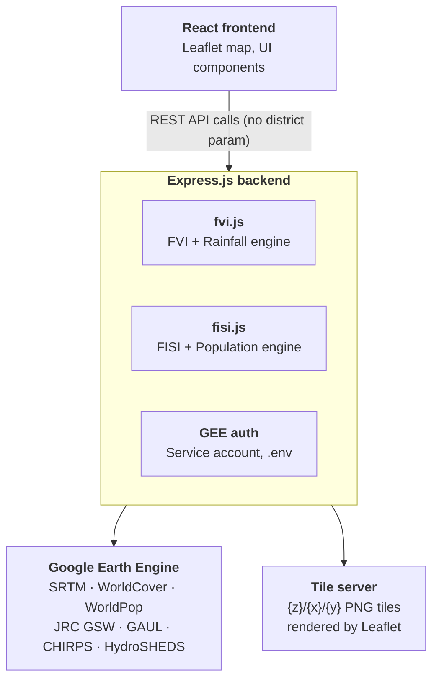

# Chennai Flood Vulnerability Index (CFVI) & Flood Inundation Susceptibility Index (FISI)

**Complete Project Documentation**

**Project by:** Abhishek S & Puvanakumar B  
**Organization:** M.S. Swaminathan Research Foundation (MSSRF), Chennai  
**Internship:** Remote Sensing & Geospatial Analysis (June–August 2026)  
**Status:** ✅ Production Ready  
**Version:** 3.0 (Chennai-only, Optimized)  
**Live:** https://chennai-flood-vulnerability-index.vercel.app  
**Repository:** [https://github.com/abhi-git06/CHENNAI-FLOOD-VULNERABILITY-INDEX](https://github.com/abhi-git06/CHENNAI-FLOOD-VULNERABILITY-INDEX)    
**Last Updated:** July 15, 2026  

---

## 📋 Table of Contents

1. [Project Overview](#project-overview)
2. [Key Features](#key-features)
3. [Tech Stack](#tech-stack)
4. [Architecture](#architecture)
5. [Data Sources](#data-sources)
6. [Indices Explanation](#indices-explanation)
7. [Getting Started](#getting-started)
8. [API Documentation](#api-documentation)
9. [Frontend Components](#frontend-components)
10. [Deployment Guide](#deployment-guide)
11. [Troubleshooting](#troubleshooting)
12. [Future Enhancements](#future-enhancements)

---

## 🎯 Project Overview

A full-stack geospatial web application for analyzing and visualizing **flood vulnerability** and **flood inundation susceptibility** across **Chennai district** using satellite imagery, geospatial analysis, and rainfall simulation via Google Earth Engine.

### What It Does

- **Flood Vulnerability Index (CFVI):** Long-term risk based on elevation, slope, proximity to water, land use, and population
- **Flood Inundation Susceptibility Index (FISI):** Short-term risk based on topography, flow accumulation, and long-term rainfall
- **Rainfall Simulation:** Real-time water inundation visualization at 5cm, 15cm, 30cm, 50cm rainfall levels
- **Interactive Analysis:** Click-to-inspect pixel values, swipe comparison, parameter weight visualization

### Study Area

**Chennai District** — the entire district boundary, clipped from the FAO GAUL 2015 Level 2 administrative boundary dataset. All GEE computations run exclusively within this boundary for fast response times.

---

## ✨ Key Features

### 🗺️ Interactive Map
- **Basemap Toggle:** Switch between Google Satellite imagery and OpenStreetMap
- **FVI/FISI Layer:** Color-coded vulnerability overlay (green → red, 1–5 scale)
- **Opacity Control:** Adjust layer transparency (0–100%)
- **Auto-centered** on Chennai at startup — no district selection needed

### 🌧️ Rainfall Simulation
- **4 Scenarios:** 5cm, 15cm, 30cm, 50cm rainfall
- **Real-time Visualization:** Water inundation layer replaces FVI during simulation
- **Live Stats:** Flooded area (km²), average depth (m), severity classification
- **Elevation-based flood line:** 1cm rainfall ≈ 0.5m flood elevation threshold (capped at 30m)

### 📊 Analysis Tools
- **Animated Statistics:** Mean CFVI/FISI scores count up smoothly on load
- **Click-to-Inspect:** Sample exact index values + elevation, slope, distance to water at any point inside Chennai. Clicks outside Chennai are blocked client-side (bbox check) and server-side (polygon check) — no wasted GEE calls
- **Swipe Comparison:** Drag divider to compare satellite imagery vs vulnerability layer
- **Parameter Weights:** Visual bar chart showing contribution of each risk factor
- **Population Density Overlay:** Independent WorldPop layer with opacity control (FISI mode)

### 📈 Data Visualization
- **CFVI Weights:** Elevation 25% | Slope 20% | Distance to Water 20% | LULC 15% | Population 20%
- **FISI Weights:** Elevation 25% | Distance to Water 20% | Flow Accumulation 20% | Slope 15% | Rainfall 15% | LULC 5%
- **Legend Panels:** 5-level classification (Very Low → Very High) for all indices

---

## 🛠️ Tech Stack

### Frontend
| Component | Technology | Version |  
|-----------|-----------|---------|  
| UI Framework | React | 18.3.1 |  
| Mapping | Leaflet | 1.9.4 |  
| React Maps | React-Leaflet | 4.2.1 |  
| Comparison Mode | Leaflet-Side-by-Side | 2.2.0 |  
| Styling | CSS3 (Custom) | — |  
| Build Tool | React Scripts | 5.0.1 |  

### Backend
| Component | Technology | Version |  
|-----------|-----------|---------| 
| Runtime | Node.js | 16+ |  
| Framework | Express.js | 4.x |  
| GEE Client | @google/earthengine | Latest |  
| Auth | Service Account OAuth 2.0 | — |  

### Deployment
| Service | Platform |
|---------|----------|
| Frontend | Vercel |
| Backend | Render |
| GEE | Google Earth Engine (service account) |

---

## 🏗️ Architecture



### Data Flow

1. Frontend starts → fetches `/api/flood-index` and `/api/fisi/meta` immediately (no user action needed)
2. Backend authenticates with GEE via service account on startup
3. `fvi.js` / `fisi.js` build Chennai-clipped GEE image graphs and memoize them in-process
4. `ee.Image.getMapId()` returns a tile URL from GEE's tile server
5. Backend returns `{ tileUrl, stats }` to frontend
6. Leaflet renders the tile layer on the map; stats animate in the sidebar

---

## 📡 Data Sources

| Layer | Source | Dataset | Resolution |
|-------|--------|---------|-----------|
| Elevation | USGS | SRTM 30m (`USGS/SRTMGL1_003`) | 30m |
| Slope | Derived | `ee.Terrain.slope()` from SRTM | 30m |
| Distance to Water | JRC | Global Surface Water v1.4 (`JRC/GSW1_4`) | 30m |
| Land Use / Land Cover | ESA | WorldCover v200 2021 (`ESA/WorldCover/v200`) | 10m |
| Population Density | WorldPop | 2020 (`WorldPop/GP/100m/pop`) | 100m |
| Flow Accumulation | WWF | HydroSHEDS 15-arcsec (`WWF/HydroSHEDS/15ACC`) | ~500m |
| Long-term Rainfall | UCSB | CHIRPS Daily 1981–2023 mean (`UCSB-CHG/CHIRPS/DAILY`) | ~5km |
| Admin Boundary | FAO | GAUL 2015 Level 2 (`FAO/GAUL/2015/level2`) | Vector |

---

## 📐 Indices Explanation

### Flood Vulnerability Index (CFVI)

Measures **long-term chronic flood risk** based on permanent geographic, land-use, and demographic factors.

**Formula:**
```
CFVI = (Elevation × 0.25) + (Slope × 0.20) + (Distance to Water × 0.20)
      + (LULC Risk × 0.15) + (Population Density × 0.20)
```

**Scale (1–5):**

| Score | Class | Color |
|-------|-------|-------|
| 1.0 – 1.8 | Low | 🟢 Green |
| 1.8 – 2.4 | Moderately Low | 🟡 Yellow-Green |
| 2.4 – 3.2 | Moderate | 🟡 Yellow |
| 3.2 – 4.0 | High | 🟠 Orange |
| 4.0 – 5.0 | Very High | 🔴 Red |
| 6 | Water Body | 🔵 Blue |

**LULC risk mapping (ESA WorldCover codes):**

| Class | Code | Risk |
|-------|------|------|
| Built-up | 50 | Very High (5) |
| Wetlands | 90, 95 | Very High / High |
| Cropland | 40 | Moderate (3) |
| Shrubland / Herbaceous | 20, 30 | Low (2) |
| Tree Cover | 10 | Low (2) |

---

### Flood Inundation Susceptibility Index (FISI)

Measures **short-term acute inundation risk** based on topography, drainage, and long-term rainfall patterns. Population and land use are excluded by design — FISI is useful for infrastructure planning independent of human presence.

**Formula:**
```
FISI = (Elevation × 0.25) + (Distance to Water × 0.20)
      + (Flow Accumulation × 0.20) + (Slope × 0.15)
      + (Long-term Rainfall × 0.15) + (LULC × 0.05)
```

All parameters are reclassified using **Chennai-specific quantile breaks** (20th, 40th, 60th, 80th percentiles), so the 1–5 scale is calibrated to the local data distribution rather than fixed global thresholds.

---

### Rainfall Simulation

Scenario-based inundation using DEM elevation thresholding:

```
flood_elevation_threshold = min(rainfall_cm × 0.5, 30) metres
flood_depth = threshold − DEM  [for pixels where DEM < threshold]
```

| Rainfall | Flood Line | Severity |
|----------|------------|----------|
| 5 cm | 2.5 m | Moderate |
| 15 cm | 7.5 m | High |
| 30 cm | 15 m | Severe |
| 50 cm | 25 m | Extreme |

---

## 🚀 Getting Started

### Prerequisites

- Node.js 16+
- npm
- A Google Earth Engine service account with the Earth Engine API enabled

### Step 1: Clone the Repository

```bash
git clone https://github.com/abhi-git06/CHENNAI-FLOOD-VULNERABILITY-INDEX.git
cd "Tamil Nadu Flood Vulnerability Index"
```

### Step 2: GEE Service Account Setup

1. Go to [Google Cloud Console](https://console.cloud.google.com)
2. Enable the **Earth Engine API**
3. Create a Service Account under IAM → Service Accounts
4. Generate a JSON key and save it as `backend/service-account-key.json`
5. Register the service account email at https://signup.earthengine.google.com and wait ~5 minutes for approval

### Step 3: Backend Setup

```bash
cd backend
npm install

# Create .env
echo "GEE_KEY_FILE=./service-account-key.json
PORT=3001" > .env

npm start
# Expected: ✅ GEE authenticated and initialized
#           🌊 CFVI backend running on http://localhost:3001
```

### Step 4: Frontend Setup

```bash
cd ../frontend
npm install

# Create .env (point to local backend)
echo "REACT_APP_API_URL=http://localhost:3001" > .env

npm start
# Opens http://localhost:3000
```

### Step 5: Verify

Open **http://localhost:3000**. The map should auto-load Chennai, and within ~5–10 seconds the FVI vulnerability layer should appear. Click the **FISI** button top-right to switch indices.

---

## 📡 API Documentation

### Base URL
- **Local:** `http://localhost:3001`
- **Production:** `https://chennai-fvi-backend.onrender.com`

All endpoints are **Chennai-only** — no `district` parameter is accepted or needed.

---

### GET `/api/flood-index`

Compute the Chennai Flood Vulnerability Index tile and statistics.

**Response (200 OK):**
```json
{
  "tileUrl": "https://earthengine.googleapis.com/v1/projects/earthengine-legacy/maps/xxx/tiles/{z}/{x}/{y}",
  "stats": {
    "meanFVI": 3.311,
    "classification": "High",
    "district": "Chennai"
  }
}
```

```bash
curl http://localhost:3001/api/flood-index
```

**Response time:** 3–10 seconds (first call builds GEE graph; subsequent calls reuse the memoized image)

---

### GET `/api/fisi`

Compute the FISI tile and statistics for Chennai.

**Response (200 OK):**
```json
{
  "tileUrl": "https://earthengine.googleapis.com/v1/.../tiles/{z}/{x}/{y}",
  "stats": {
    "meanFISI": 2.847,
    "classification": "Moderate",
    "district": "Chennai",
    "susceptiblePixels": 45832,
    "totalInundationAreaKm2": 412.5,
    "percentAffected": 65.3
  }
}
```

```bash
curl http://localhost:3001/api/fisi
```

---

### GET `/api/fisi/meta`

Parameter weights and data sources — served from backend config so the frontend never hardcodes them.

**Response (200 OK):**
```json
{
  "weights": [
    { "name": "Elevation", "w": 25 },
    { "name": "Distance from Water Body", "w": 20 },
    { "name": "Flow Accumulation", "w": 20 },
    { "name": "Slope", "w": 15 },
    { "name": "Rainfall", "w": 15 },
    { "name": "LULC", "w": 5 }
  ],
  "parameters": [
    { "name": "Elevation", "source": "SRTM 30m" },
    { "name": "Long-term Average Rainfall", "source": "CHIRPS Daily (1981–2023 mean)" }
  ]
}
```

---

### GET `/api/simulate-rainfall`

Simulate flood inundation over Chennai for a given rainfall amount.

**Query Parameters:**
| Parameter | Type | Required | Example |
|-----------|------|----------|---------|
| `rainfall` | number (cm) | Yes | `30` |

**Response (200 OK):**
```json
{
  "tileUrl": "https://earthengine.googleapis.com/v1/.../tiles/{z}/{x}/{y}",
  "stats": {
    "rainfallCm": 30,
    "rainfallMm": 300,
    "floodElevationThreshold": 15.0,
    "floodedPixels": 23041,
    "floodedAreaSqKm": 186.83,
    "avgFloodDepthM": 5.37,
    "maxFloodDepthM": 15.00,
    "classification": "High",
    "district": "Chennai"
  }
}
```

```bash
curl "http://localhost:3001/api/simulate-rainfall?rainfall=30"
```

---

### GET `/api/inspect`

Sample the FVI computation at a single lat/lng point inside Chennai.

**Query Parameters:**
| Parameter | Type | Range |
|-----------|------|-------|
| `lat` | number | decimal degrees |
| `lng` | number | decimal degrees |

**Response (200 OK — inside Chennai):**
```json
{
  "lat": 13.0827,
  "lng": 80.2707,
  "fvi": 3.42,
  "classification": "High",
  "isWater": false,
  "elevation_m": 8.5,
  "slope_deg": 2.1,
  "coast_distance_m": 1250,
  "population_per_ha": 450
}
```

**Response (200 OK — outside Chennai):**
```json
{ "outsideChennai": true }
```

```bash
curl "http://localhost:3001/api/inspect?lat=13.0827&lng=80.2707"
```

---

### GET `/api/fisi/inspect`

Sample FISI at a single point inside Chennai. Same contract as `/api/inspect` but returns `fisi` instead of `fvi`, and `distance_to_water_m` instead of `coast_distance_m`.

```bash
curl "http://localhost:3001/api/fisi/inspect?lat=13.0827&lng=80.2707"
```

---

### GET `/api/population`

WorldPop population density classified layer for Chennai.

**Response (200 OK):**
```json
{
  "tileUrl": "https://earthengine.googleapis.com/v1/.../tiles/{z}/{x}/{y}",
  "stats": {
    "totalPopulation": 7088000,
    "meanDensityPerKm2": 26903.4,
    "district": "Chennai"
  }
}
```

---

### GET `/health`

```json
{ "status": "ok", "geeReady": true }
```

---

## 💻 Frontend Components

### Component Tree

```
App.jsx
├── Sidebar
│   ├── Header (Chennai brand + subtitle)
│   ├── [FISI mode] PopulationToggle
│   ├── [FVI mode]  Rainfall Simulation section
│   ├── [FVI mode]  FVI Stats card + meta-grid
│   └── [FISI mode] FISIPanel
├── Map Container
│   ├── TileLayer (basemap)
│   ├── GEETileLayer (FVI or FISI, crossfade on switch)
│   ├── GEETileLayer (population overlay, FISI mode)
│   ├── GEETileLayer (rainfall simulation, FVI mode)
│   ├── SwipeTileLayer (compare mode)
│   └── ClickInspector
├── Regional Breakdown (floating, FVI mode only)
├── FVI / FISI mode toggle (top-right)
├── Map controls (basemap, opacity, compare, inspect)
├── Map label (bottom-center)
└── Legend stack (bottom-right)
    ├── PopulationLegend (FISI + pop overlay)
    ├── FISILegend / FVI Legend / Rainfall Legend
    └── FISIWeights / FVI weights bar chart
```

### Key Component Notes

**`App.jsx`** — No `selectedDistrict` state; all fetch calls hit parameterless endpoints. FVI fetch runs once on mount; FISI fetch runs once when FISI mode is first activated. Population fetch runs once when the population toggle is first enabled. All results are cached in state for the session.

**`ClickInspector.jsx`** — Two-stage Chennai validation: (1) a fast client-side bounding box check before any network request; (2) the backend performs an exact `geom.containsPoint()` polygon check before any GEE sampling. Points outside Chennai get a friendly message at zero GEE cost.

**`RegionalBreakdown.jsx`** — Now hardcoded to `district="chennai"`.

---

## 🌐 Deployment Guide

### Frontend (Vercel)

1. Connect GitHub repo at https://vercel.com
2. Root Directory: `./frontend`
3. Build Command: `npm run build`
4. Output Directory: `build`
5. Environment variable: `REACT_APP_API_URL` → your Render backend URL
6. Deploy — auto-deploys on every push to `main`

### Backend (Render)

1. New Web Service → connect GitHub repo
2. Root Directory: `./backend`
3. Build Command: `npm install`
4. Start Command: `node server.js`
5. Environment variables:
   - `GEE_KEY_FILE` → `/etc/secrets/service-account-key.json`
   - `PORT` → `3001`
6. Add Secret File: filename `service-account-key.json`, paste your GEE JSON key content

> **Note:** Render free tier sleeps after 15 min inactivity. The first request after sleep takes ~30 seconds (GEE re-authentication). Upgrade to a paid plan if this is unacceptable.

### Local Development (Copy/Paste)

Since `.env` files and `service-account-key.json` are gitignored, they travel with the folder when you copy it — no changes needed except pointing the frontend at localhost:

```bash
# In frontend/.env
REACT_APP_API_URL=http://localhost:3001
```

Then start both servers:
```bash
# Terminal 1
cd backend && npm start

# Terminal 2
cd frontend && npm start
```

---

## 🔧 Troubleshooting

### `GEE_KEY_FILE not found`
```bash
cd backend
echo "GEE_KEY_FILE=./service-account-key.json\nPORT=3001" > .env
ls service-account-key.json   # confirm it exists
npm start
```

### `GEE auth failed`
The service account email hasn't been registered with Earth Engine yet.
- Copy the `client_email` from your `service-account-key.json`
- Go to https://signup.earthengine.google.com
- Paste the email, complete signup
- Wait 5 minutes, then restart the backend

### `503 GEE not ready`
GEE initialization is still in progress (usually takes 5–10 seconds after `npm start`). Wait and retry.

### No tiles on map
```bash
# Check backend health
curl http://localhost:3001/health
# Expected: {"status":"ok","geeReady":true}

# Check frontend .env points to correct backend
cat frontend/.env
```

### Click-to-Inspect shows "Outside Study Area"
You clicked outside the Chennai district boundary. Zoom in to Chennai and try again.

### Rainfall simulation not appearing
Make sure you're in **FVI mode** (not FISI). The rainfall section only shows in FVI mode.

---

## 🚀 Future Enhancements

### Short Term (Q3 2026)
- [ ] Cache GEE tile URLs (TTL ~6 hours) — eliminates re-computation on page reload
- [ ] Mobile-responsive sidebar layout
- [ ] Loading skeleton for map area during GEE computation

### Medium Term (Q4 2026)
- [ ] Taluk-level breakdown within Chennai
- [ ] Time-series FVI (2015–2026) to track change
- [ ] Storm surge module (tidal + cyclone track overlay)
- [ ] PDF report export with map screenshots and stats

### Long Term (2027+)
- [ ] Real-time IMD rainfall alert integration
- [ ] ML-based flood prediction from historical data
- [ ] Expand back to multi-district Tamil Nadu coastal coverage (with pre-computed tiles)
- [ ] Crowdsourced flood incident reporting layer

---

## 📚 Resources

- **GEE JavaScript API:** https://developers.google.com/earth-engine
- **SRTM DEM:** https://usgs.gov
- **ESA WorldCover:** https://worldcover.org
- **WorldPop:** https://worldpop.org
- **JRC Global Surface Water:** https://global-surface-water.appspot.com
- **CHIRPS Rainfall:** https://www.chc.ucsb.edu/data/chirps
- **HydroSHEDS:** https://www.hydrosheds.org
- **Leaflet:** https://leafletjs.com
- **React-Leaflet:** https://react-leaflet.js.org

---

## 👨‍💻 Team

**Abhishek S & Puvanakumar B**  
M.S. Swaminathan Research Foundation (MSSRF), Chennai  
Remote Sensing & Geospatial Analysis Internship — June–August 2026  

**GitHub Issues:** [https://github.com/abhi-git06/CHENNAI-FLOOD-VULNERABILITY-INDEX/issues](https://github.com/abhi-git06/CHENNAI-FLOOD-VULNERABILITY-INDEX/issues)    
**Email:** abhishajidav10@gmail.com  

---

## 🙏 Acknowledgments

Google Earth Engine · USGS · ESA · WorldPop · JRC · WWF HydroSHEDS · UCSB CHIRPS
Leaflet · React · Vercel · Render · M.S. Swaminathan Research Foundation

---

**Status:** ✅ Production Ready | **Version:** 3.0 | **Last Updated:** July 15, 2026  
**Live:** https://chennai-flood-vulnerability-index.vercel.app  

---

**Happy Mapping! 🗺️🌊**
